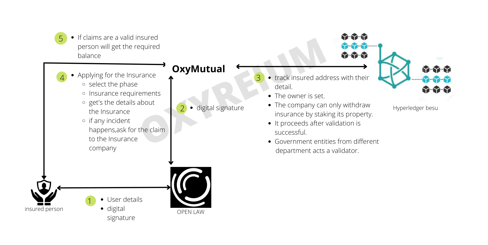

# OxyMutual

OxyMutual is a blockchain-based insurance company with profound improvements such as decentralized parties and improved efficiency. It follows `IBFT 2.0` POA(Proof of Authority) consensus mechanism and stores all its data in a private blockchain maintained using `Hyperledger Besu` keeping account of users' privacy with the `integration of government` entities which act as validators based on the POA mechanism, showing clear `transparancy`, complete elimination of `Brokerage Model` and math-based agreement. The agreement between the two parties, i.e., the insurance company and the insured person, is also stored in a private blockchain using `Open Law`.

The validators are primarily from the government sector, including the Police Department, the Government Insurance Association, lawyers, local government representatives, government banking, and others.OxyMutual invests in government national projects that prevent the outflow of "National Currency" with the integration of government.

| **Table of Content**                                                       |
| -------------------------------------------------------------------------- |
| **Why Decentralized Insurance?**                                           |
| - Cons of Traditional Insurance                                            |
| - Impact Created by OxyMutual                                              |
| **OxyMutual Architecture**                                                 |
| **Steps To Run The OxyMutual**                                             |
| - REQUIREMENTS                                                             |
| - QUICKSTART                                                               |
| - USAGE                                                                    |
| - DEPLOY                                                                   |
| - TESTING                                                                  |
| **Deployment to a testnet or mainnet [RINKEBY TESTNET /ETHEREUM NETWORK]** |
| **Deployment to a testnet or mainnet [MUMBAI TESTNET /POLYGON NETWORK]**   |
| **Deployment to Hperledger Besu**                                          |
| - REQUIREMENTS                                                             |
| - QUICKSTART                                                               |
| **Playing around in Remix**                                                |
| **Verify on etherscan**                                                    |
| **Draft (How did we begin it?)**                                           |
| - Approach                                                                 |

## Why Decentralized Insurance?

**Cons of Traditional Insurance**

**Loyalty / Trust Issues**

Insurance companies are in business for the sole purpose of making money rather than giving out money. So, traditional insurance companies will try their best to find the fault. They are the only ones who are making the decision. Even if the insured person's claim is valid, the company might refuse to give us the necessary amount. So our best option is to file a case and fight our claim even though we should have gotten money after having a valid claim.

**The claim takes longer to resolve**

There are lots of documents to review before making a decision. So, it might take more than a month to resolve the valid claim.

**Commission System**

Due to brokers in between, they get a certain percent commission where if the percent is given to the client, he/she could utilize it for other purposes.

## Impact Created by OxyMutual

**POA Consensus overtaking centralized power**

The decision of the claim is validated by the validator by seizing the centralized power from the insurance company.

**Integration with the Government (Validators)**

The Validators are especially from the government sector, such as the Police Department, Government Insurance Association, Lawyers, Local Government Representatives, Government Banking, and more, which create `transparency` and `trust` in the public.

**Government participants' increase in investing in the governmental national projects**

OxyMutual invests in government national projects which prevent the outgoing of national currency.

**Decentralized Agreement**

OxyMutual uses `Open Law` to create an agreement that is signed by both parties if they agree.

**Payment is done by mathematical algorithms**

If all necessary claims are met `ChainLink Keeper` fires up and all the required amount is deposited into the client's wallet.

**Pirvacy**

Data is stored in a private blockchain using `HyperLegder Besu` keeping account of clients' privacy.

## OxyMutual Architecture



## Steps To Run The OxyMutual

**REQUIREMENTS**

-   [git](https://git-scm.com/book/en/v2/Getting-Started-Installing-Git)

-   You'll know you did it right if you can run git --version and you see a response like "git version x.x.x".

-   [Nodejs](https://classic.yarnpkg.com/lang/en/docs/install/)

-   You'll know you've installed nodejs right if you can run:

-   node --version and get an output like: vx.x.x

-   [Yarn](https://yarnpkg.com/getting-started/install) instead of npm

-   You'll know you've installed yarn right if you can run:

-   yarn --version and get an output like: x.x.x

-   You might need to [install it with npm]() or corepack

### QUICKSTART

```

    git clone https://github.com/spo0ds/OxyMutual.git

    cd OxyMutual

    yarn

```

### USAGE

To run Locally on ganache-cli

```

    yarn ganache-cli

```

### DEPLOY

```

    yarn truffle migrate

```

### TESTING

```

    yarn truffle test

```

### 1. Deployment to a testnet or mainnet [RINKEBY TESTNET /ETHEREUM NETWORK]

1. Setup environment variabltes

You'll want to set your RINKEBY_RPC_URL and PRIVATE_KEY as environment variables. You can add them to a .env file, similar to what you see in .env.example.

-   PRIVATE_KEY: The private key of your account (like from [metamask](https://metamask.io/)). NOTE: FOR DEVELOPMENT, PLEASE USE A KEY THAT DOESN'T HAVE ANY REAL FUNDS ASSOCIATED WITH IT.

-   RINKEBY_RPC_URL: This is the url of the rinkeby testnet node you're working with. You can get setup with one for free from [Alchemy](https://alchemy.com/?a=673c802981)

2. Get testnet ETH

Head over to [faucets.chain.link](https://faucets.chain.link/) and get some tesnet ETH & LINK. You should see ETH and LINK show up in your metamask. [You can read more on setting up your wallet with LINK.](https://docs.chain.link/docs/deploy-your-first-contract/#install-and-fund-your-metamask-wallet)

### 2. Deployment to a testnet or mainnet [MUMBAI TESTNET /POLYGON NETWORK]

1. Setup environment variabltes

You'll want to set your MUMBAI_RPC_URL and PRIVATE_KEY as environment variables. You can add them to a .env file, similar to what you see in .env.example.

-   PRIVATE_KEY: The private key of your account (like from [metamask](https://metamask.io/)). NOTE: FOR DEVELOPMENT, PLEASE USE A KEY THAT DOESN'T HAVE ANY REAL FUNDS ASSOCIATED WITH IT.

-   POLYGON_RPC_URL: This is url of the rinkeby testnet node you're working with. You can get setup with one for free from [Alchemy](https://alchemy.com/?a=673c802981)

2. Get testnet MATIC

Head over to [faucet.polygon.technology](https://faucet.polygon.technology/) and get some tesnet MATIC & LINK. You should see MATIC and LINK show up in your metamask. [You can read more on setting up your wallet with LINK.](https://docs.chain.link/docs/deploy-your-first-contract/#install-and-fund-your-metamask-wallet)

### 3. Deployment to Hperledger Besu

**REQUIREMENTS**

[Java JDK](https://www.oracle.com/java/technologies/downloads/)

-   You'll know you've installed Java right if you can run: - java --version and get an ouput like: vx.x.x

[Hyperledger Besu](https://github.com/hyperledger/besu/releases)

-   To confirm installation, run `bin/besu --help`

### QUICKSTART

To run a node to develop smart contracts with Hyperledger Besu and Truffle

-   Go to the besu file path that is inside the bin folder. - Run the below command

`./besu --network=dev --miner-enabled --miner-coinbase=0xfe3b557e8fb62b89f4916b721be55ceb828dbd73 --rpc-http-cors-origins="all" --host-allowlist="*" --rpc-ws-enabled --rpc-http-enabled --data-path=/tmp/tmpDatdir`

-   To deploy on a Besu network, run the below command.

`yarn truffle migrate --network besu`

To create a private POA Ethereum network with Hyperledger Besu

-   Go to the besu file path that is inside the bin folder.

-   You can follow the [documentation](https://besu.hyperledger.org/en/stable/Tutorials/Private-Network/Create-IBFT-Network/#stop-the-nodes) to start running the node.

-   To run the root node of the blockchain.

`./besu --data-path=./IBFT-Network/Node-1 --genesis-file=./IBFT-Network/genesis.json --rpc-http-enabled --rpc-http-api=ETH,NET,IBFT --host-allowlist="*" --rpc-http-cors-origins="all"`

-   To run a second validator.

`./besu --data-path=./IBFT-Network/Node-2 --genesis-file=./IBFT-Network/genesis.json --bootnodes=enode://6f266aca4bf476f24bcba87d9328b6ee9239772aa7cd9d1c963e46bd841d7b2adae405024b4efcc64f3fbc4e56731a603763e588ce52bb402f042de3f58b8e16@127.0.0.1:30303 --p2p-port=30304 --rpc-http-enabled --rpc-http-api=ETH,NET,IBFT --host-allowlist="*" --rpc-http-cors-origins="all" --rpc-http-port=8546`

-   To run a third validator.

`./besu --data-path=./IBFT-Network/Node-3 --genesis-file=./IBFT-Network/genesis.json --bootnodes=enode://6f266aca4bf476f24bcba87d9328b6ee9239772aa7cd9d1c963e46bd841d7b2adae405024b4efcc64f3fbc4e56731a603763e588ce52bb402f042de3f58b8e16@127.0.0.1:30303 --p2p-port=30305 --rpc-http-enabled --rpc-http-api=ETH,NET,IBFT --host-allowlist="*" --rpc-http-cors-origins="all" --rpc-http-port=8547`

-   To run a fourth validator

`./besu --data-path=./IBFT-Network/Node-4 --genesis-file=./IBFT-Network/genesis.json --bootnodes=enode://6f266aca4bf476f24bcba87d9328b6ee9239772aa7cd9d1c963e46bd841d7b2adae405024b4efcc64f3fbc4e56731a603763e588ce52bb402f042de3f58b8e16@127.0.0.1:30303 --p2p-port=30306 --rpc-http-enabled --rpc-http-api=ETH,NET,IBFT --host-allowlist="*" --rpc-http-cors-origins="all" --rpc-http-port=8548`

-   To confirm the private network is working

`curl -X POST --data '{"jsonrpc":"2.0","method":"ibft_getValidatorsByBlockNumber","params":["latest"], "id":1}' localhost:8545`

-   After you get some output as a success, you can deploy your contract on a private blockchain following the IBFT 2.0 POA consensus mechanism.

`yarn truffle migrate --network besuIBFT`

### 4. Playing around in Remix

```

1. Copy the contract Types.sol, Insurance.sol, Insured.sol and Validators.sol.

2. Deploy Validators.sol first passing it the array of validator arrays and the number of required validates.

3. After that, deploy the insurance contract, passing it the address of the owner and the Validators.sol contract address.

4. Then deploy the Insured.sol passing in the required arguments.

5. Play with all the functions of the contract.

```

## Verify on etherscan

If you deploy to a testnet or mainnet, you can verify it if you get an [API Key](https://etherscan.io/myapikey) from Etherscan and set it as an environment variable named ETHERSCAN_API_KEY. You can pop it into your .env file as seen in the .env.example.

In it's current state, if you have your api key set, it will auto verify kovan contracts!

However, you can manually verify it with:

`yarn truffe run verify **ContractName** --network **NetworkName**`

# Draft (How did we begin it?)

**Approach**

**What does the insurance contract need to do?**

-   First track the insured address with the details

-   If the necessary conditions are fulfilled, chainlink keepers fire up

-   The insurance period has come to an end.

-   Insured person has the right to claim

-   Full payment has been made and he/she has agreed to

-   Has no more than three delayed payments

-   Owner of the insurance is set

-   Because he can withdraw the amount.

-The company wants to profit from the business as well.

-   but only by staking the property.

-   All insured paid amounts are added to the contract balance.

-   If insurance fails to give the amount in time, a 10% fine will be charged.

-   3 delay of payments leads to no longer being insured and you won't get any money back.

-   only the owner can see the balance and deposit in the contract.

**What does client/insured will be able to do?**

-   Apply for the insurance, select the payment phase, and provide all the insurance requirements.

-   Insured person pays the amount for the insurance.

-   Get's the details about the insurance

-   If any incident happens, ask for a claim from the insurance company.

Everything will be deployed on a Hyperledger Besu (private Ethereum blockchain) following the IBFT 2.0 POA consensus algorithm with 4 validators.

# THANK YOU!
